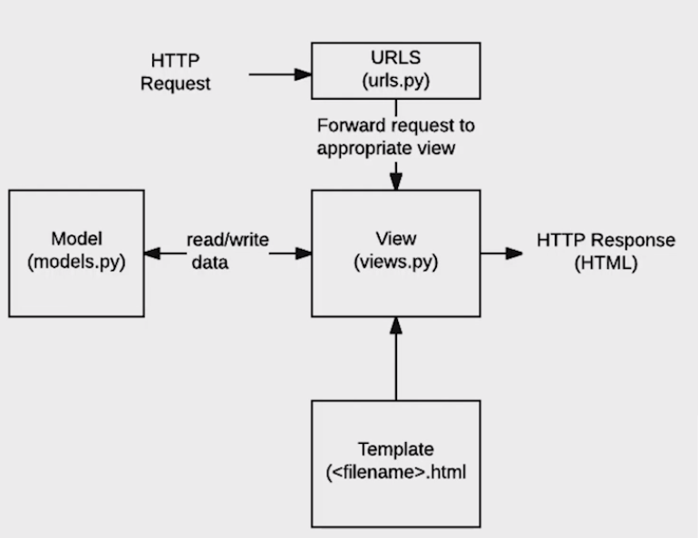

# django

Dynamic Web Web Application Program

## Dynamic web vs Static web

사용자의 요청에 따라 다르게 반응: 동적 web

다른 요청에도 같은 반응: 동적 web ex) github.io

## web framework

기본적인 구조나 필요한 코드 제공

### 	django what, why, how?

- django는 python기반의 web framework

- 검증된 frame work : 전세계적으로 오랫동안 써왔다.

- 오랫동안 꾸준히 version up -> 개발자 커뮤니티 활발

- django는 MTV(model, template, view) 구조의 디자인 패턴

  | MVC 패턴   | django                      |
  | ---------- | --------------------------- |
  | Model      | Model (데이터 관리)         |
  | View       | Template (인터페이스, 화면) |
  | Controller | View (중간관리, 상호 동작)  |

- 데이터의 흐름

  **HTTP Request**요청 -> **URLS**urls에서 url을 받고 -> **View**요청에 따른 함수 실행 -> **Template**template에서 데이터 가져오기 -> **Response**사용자에게 응답

  

## 코드 작성 순서

1. urls.py
2. views.py
3. templates

```python
#1. terminal에
pip list #Django가 없다면
pip install django

#2. 프로젝트 생성
django-admin startproject 프로젝트 이름

#3. 프로젝트로 이동해서 서버 켜기
#	프로젝트 이동: 생성된 폴더에서 직접 vscode열기 OR 터미널에서 cd 프로젝트 이름
python manage.py runserver #서버 켜기

#4. app 생성
#	convention: 앱 이름은 복수형!
python manage.py startapp 앱이름

#5. app 등록: 프로젝트의 settings.py에 작성한 app이름 더하기
#	convention: 작성 순서 존재

#6. urls.py에서
path('index/', views.index)

from articles import views

#7. view에 동작할 함수 만들기
 def index(request):
    return render(request, 'index.html') #render(요청, 보여질 화면)

#8. template
	#articles밑에 templates폴더만들고 그 아래 index.html파일 생성
	#html파일에서 화면에 띄울 것 만들기
    
#9. 브라우저 확인
  python manage.py runserver
```

- **프로젝트 이름에 사용 못하는 것**

	1. 하이픈 X (python인 view에도 안돼.)
 	2. python, django에서 쓰는 기본 이름들 X

- **앱 이름 convention**

​	복수형!

- **app 작성 순서**

1. local apps(우리가 만든 거)
2. 3rd party apps
3. django apps(장고 기본 앱)

- view convention

  **blank 2 lines**: 함수 정의 사이에 2줄 띄우기

- django imports style guide

  1. standard library
  2. 3rd party
  3. Django
  4. local django

### 특정 데이터만 보여주기

특정 데이터를 **dictionary**형태로 render에 작성

views.py

```python
def dinner(request):
    menus = ['족발', '햄버거', '치킨', '고기']
    pick = random.choice(menus)
    
     #render(요청, 보여질 화면, 특정 데이터)
    return render(request, 'dinner.html', {'pick' : pick})
```

templates의 html

```html
 <h1> 오늘 저녁은 {{ pick }} 입니다. </h1>
```

### 여러 데이터를 한번에 보내기

context 딕셔너리 활용

views.py

```python
def dtl_practice(request):
    menus = ['짜장면', '탕수육', '짬뽕']
    empty_list = []
    context = {
        'menus': menus,
        'empty_list': empty_list,
    }
    return render(request, 'dtl_practice.html', context)
```

templates의 html

```html
  <h1>안녕하세요, {{ menus }}</h1>
```


### 검색하여 화면 전환 (catch throw)

#### throw

- 데이터 보내기 -> **form** 활용

- 데이터를 url로 받는게 아니므로, 사용자 입력을 받을 화면을 보여준다.

  views.py

  ```python
  def throw(request):
      return render(request, 'throw.html')
  ```

  templates의 html

  ```html
  <form action="/catch/" method="GET">
  
  <label for="name">데이터 입력:</label>
  <input type="text" id="name" name="name">
  <input type="submit">
      
  </form>
  ```

  - `input`의 캡션값(`id`)을 `for`로 받는다.

    - id와 name의 차이

      id는 중복X, 서버에 파라미터값으로 넘어가지X, **고유한 식별자**

      name은 중복O, action에 해당하는 페이지로 전달하는 파라미터, catch에서 받는다.

  - `action`으로 데이터를 보내려면 submit 필수

#### catch

- `throw`에서 보낸 `form`데이터를 받는다. (request.GET)

- data는 request에 있고, request 안에 GET이 존재한다.????????????????

  views.py

  ```python
  def catch(request):
      
      message = request.GET.get('name')
      context = {
          'message': message,
      }
      
      return render(request, 'catch.html', context)
  ```

  templates의 html

  ```html
  <h2>throw에서 보낸 데이터는 {{ message }}입니다.</h2>
  ```

  

