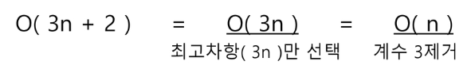

# OT

- daily 과제 제출은 **당일 12시까지**
- IM은 **2중 for + 배열** , A형은 완전검색 + 가지치기(재귀) / 시뮬레이션

# 알고리즘 

- 표현 : 슈도코드, 순서도

- 좋은 알고리즘이란? 적은 연산, 적은 메모리, 최적화

- 알고리즘 성능 분석

  - 작업량: 연산량 적을수록 Good

    ex) 1부터 100까지의 합

    ​	방법1) 덧셈 100번 

    ​	방법2) n(n+1)/2 공식 사용(3번의 연산) --> Good

    - 작업량을 표현은 **시간 복잡도**: 명령문 개수 적을수록 Good

    - 시간 복잡도 = 빅 오 표기법

      for가 하나면 n, 2중 for이면 n^2

      

|   code    |                 |
| :-------: | :-------------: |
| **data**  | 전역, 정적 변수 |
| **heap**  |   참조형 변수   |
| **stack** |    지역 변수    |

# 배열

> `일정한 자료형(type)의 변수들`을 하나의 이름으로 열거

