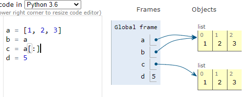

# 1. 지난 hwws 풀이

## vscode 실행법

- **경로에서 vscode 열기**, ex)바탕화면에 파일있으면 바탕화면에서 우클릭, vscode
- F5는 run의 실행키, `ctrl + backtic ` 으로 터미널 열고 `python 파일명.py`
- **저장하고 실행**!

## 0727 hw 

- 1. 모음 세기

​	`vowels = ['a', 'e', 'i', 'o', 'u']` 로 했는데 바로 vowels = 'aeiou' 해도 괜찮다.


 # 2. swea

- vscode에 풀고 복붙

- 파일명: swea_2072.py
- 주어진 입력을 다 해야 test가능 OR 출력: print(f'#{test_case} 200')
- **경로에서 vscode 열기**, ex)바탕화면에 파일있으면 바탕화면에서 우클릭, vscode
- F5는 run의 실행키, `ctrl + backtic ` 으로 터미널 열고 `python 파일명.py`
- **결과값의 공백까지 일치해야 PASS 인정**
- `import sys ~ sys.stdin`까지 지우고 제출
- swea_2072 예시

```python
T = int(input())
# 여러개의 테스트 케이스가 주어지므로, 각각을 처리합니다.
for test_case in range(1, T + 1):
    result = input().split()
    print(result)
    results_int = []
    for result in results:
        results_int.append(int(result))
    #results = map(int, input().split()) 위의 4줄코드가 이 한줄이랑 동일
    #['1', '2', '3']
    #[int('1'), int('2'), int('3')] 으로 만들어주는게 map

    #담긴 수를 하나하나 봐서
    #홀수이면 total에 더한다.
    # numbers = map(int, input().split())
    # total = 0
    # for number in numbers:
    #     if (number % 2) == 1:
    #         total += number
    # print(f'#{test_case} {total}')
```


swea는 출력 위주, 함수 만들기 연습은 프로그래머스


# 3. Practice

- 회문 판별

  - word의 양 끝에서 i번째를 비교할 때 `if word[i] == word[-1 - i]`

  - word의 양 끝이 같으면, 처음과 끝을 자르고 다시 비교

    ```python
    if word[0] == word[-1]:
        word = word[1:-1]
    ```

- 회문 판별 **재귀ver**

  ```python
  #is_pal(racecar)
  #r == r => is_pal(aceca) => len(word)<2 이면 종료
  def is_pal_recursive(word):
      if len(word) < 2:
          return True
      else:
          if word[0] == word[-1]:
              # 잘 모르겠으면 print or python tutor-live programing mode
             	return is_pal_recursive(word[1:-1]) #word[1:-1]은 앞뒤의 똑같은 문자 뺀거
          else:
              return False
  ```

- 중복되지 않은 숫자의 합

  - 읽다가, 읽은 거랑 같은 애가 나오면 지운다. (읽은 걸 담아둘 것 필요)

    ```python
    def sum_of_repeat_number(numbers):
    #list읽다가 중복나오면 지우고 다 읽고 남은 애들만 더하기
        #아직 한번만 등장한 것들[]
        #반복문 돌면서 number in 한번만 등장한 것들?
        #삭제
        #없다? 추가
        once = []
        for number in numbers:
            if number in once: #처음엔 빈 리스트->else로 가서 채운다. 
                once.remove(number)
            else:
                once.append(number)
        return sum(once)
    ```

- 썩은 과일 찾기

  - **특정 문자열 제거 = 특정 문자열을 빈 문자열로 바꾸기**
  - 대문자를 소문자로 변환하는 method: `.lower()`

  

- 기타 질문

  - map

  ```python
  numbers_str = '12 12 1 2 4 5'
  
  numbers = map(int, numbers_str.split())
  
  #list가 아니다.
  
  #len 쓸 수 없다. len 쓰려면 list(map) 해야 한다.
  
  print(numbers) #=>map object
  ```

# 4. 0728 hwws

- sorted()와 .sort() 

  - sorted()는 return이 있고, .sort()는 없다.
  - sorted()는 원본이 변하지 않고, .sort()는 변한다.

  ```python
  numbers = [1,4,6,1,2,5,2,5,6,1]
  print(sorted(numbers)) #=> [1, 1, 1, 2, 2, 4, 5, 5, 6, 6]
  print(numbers)
  print(numbers.sort()) #=> None
  print(numbers)
  ```

- extend()와 .append()

  - extend는 여러 개 추가, append는 하나만 추가
  - extend는 list 형태로, append는 추가할 형태로

- **List 복사**

  - **List는  주소값을 저장(가리키기), integer는 변수에 값 저장**
  - `b = a[:]` slicing을 하면 새로운 List를 하나 더 만드는 것

  

  


