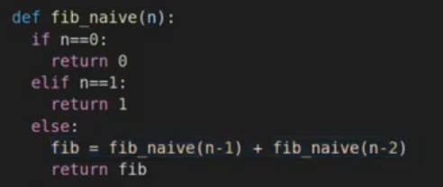
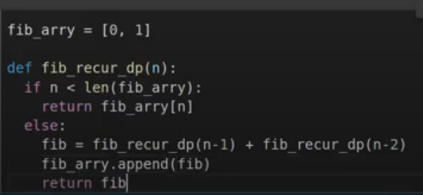
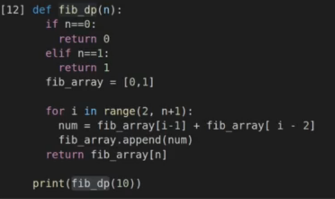

# DP

1. naive한 피보나치수열
   - 단점: 오래 걸린다

2. recursive DP (`top-down`)

   - 장점: 빠르다

   - 단점: n이 크면 최대 재귀 호출 횟수를 초과한다. 

     ​		 `maximum recursion depth exceeded in comparison 에러`

     

3. recursive DP (`bottom-up`)

   - top-down 방식의 단점을 해결한다.

출처: https://www.youtube.com/watch?v=eJC2oetXaNk